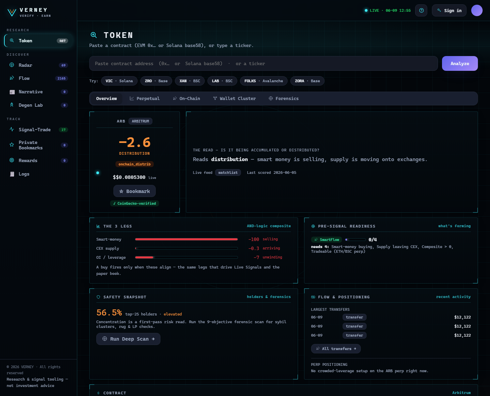

# Welcome to VERNEY

**VERNEY** is a crypto trading-intelligence terminal. It exists to answer **one question** about any
token:

> **Is this being accumulated or distributed — and is it safe?**

It answers that by fusing four data layers that usually live in separate tools:

* **On-chain** — who holds, who's moving supply, who's connected to whom.
* **Exchange supply** — coins flowing into / out of CEX wallets.
* **Derivatives** — coin-denominated open interest & divergence.
* **Macro news** — real-time headlines scored for market impact.

The live terminal is at **[verney-terminal.vercel.app](https://verney-terminal.vercel.app)**.

<figure><figcaption>
The Token Workspace — one composite verdict (accumulation vs distribution), a live market snapshot, and the on-chain tabs that work on any contract.
</figcaption></figure>


**New here?** The terminal greets first-time visitors with a **guided interactive demo** that drives
itself through every module. You can replay it any time with the **❔** button in the top bar.


---

## What you can do

| Goal | Where | Page |
| --- | --- | --- |
| Research one token in depth | **Research → Token** | [Token Workspace](research/token-workspace.md) |
| Check if a token is a scam / rug | **Token → Forensics** | [Deep Scan](research/deep-scan.md) |
| See which holders are secretly connected | **Token → Wallet Cluster** | [Wallet Cluster](research/wallet-cluster.md) |
| Catch setups *before* they trigger | **Discover → Radar** | [Radar](discover/radar.md) |
| Watch smart-money & exchange flows | **Discover → Flow** | [Flow](discover/flow.md) |
| Read the macro tape | **Discover → Narrative** | [Narrative](discover/narrative.md) |
| Scan a brand-new contract | **Discover → Degen Lab** | [Degen Lab](discover/degen-lab.md) |
| See our public paper track record | **Track → Signal-Trade** | [Signal-Trade](track/signal-trade.md) |
| Earn points & climb the leaderboard | **Track → Rewards** | [Rewards](track/rewards.md) |

---

## The 60-second mental model

1. **Research** works **one token** in depth.
2. **Discover** browses the **whole market**.
3. **Track** is the **public record** + your saved list + your rewards.

> **One rule:** a sidebar section browses *everything*; the matching **tab inside the Token workspace**
> is the *same thing* for the one token you searched. You never get lost.

Start with **[Getting Started](getting-started.md) →**


VERNEY is a research & intelligence tool. Nothing here is financial advice. Paper trades are
simulated. A clean forensic scan reduces — but never eliminates — risk.

