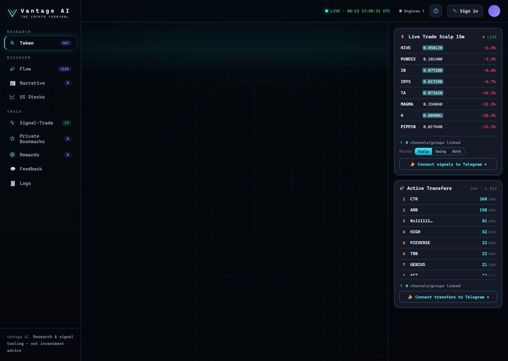

# Degen Lab

<figure><figcaption>
Degen Lab — paste a brand-new contract for a 7-gate legitimacy scan + quality score, then jump straight into Forensics & Wallet Cluster.
</figcaption></figure>

**Discover → Degen Lab** is for **brand-new tokens** that aren't in the scored universe yet. Paste a
fresh contract and get a fast legitimacy read before you touch it.

## How to use it

1. Open **Discover → Degen Lab**.
2. Paste an **EVM** (`0x…`) or **Solana** (base58) contract → it scans automatically.
3. Read the **verdict** and (optionally) jump into deeper tools.

## What you get

* A **7-gate Early-Legitimacy check** (liquidity floor, sybil ceiling, age window, etc.) — each gate
  passes or fails with a reason.
* A **0–100 quality score** with a cutoff.
* A verdict: **GO** (all gates pass + score ≥ cutoff), **WATCH** (passes but below cutoff), or **REJECT**
  (a hard gate failed).


On a **GO**, a **$1,000 paper bet** is booked (+100% take-profit · ride-to-zero · 100-day hold) into your
local **early book** — a simulated venture-style tracker so you can follow how flagged tokens play out.


## Go deeper

From a Degen result, two buttons take you straight into the [Token Workspace](../research/token-workspace.md)
for that contract:

* **🛰️ Full Forensics** → runs the live [Deep Scan](../research/deep-scan.md).
* **🧬 Wallet Cluster** → opens [Wallet Cluster](../research/wallet-cluster.md) on it.

The Overview shows a **live on-chain** card (these early tokens aren't backbone-scored yet, but every live
tool works on them).


Degen Lab is **heuristic & paper-only**. Forensics reduce but don't eliminate rug risk — a clean scan can
still rug. Early tokens are extremely high-risk.


---

**Next:** [Signal-Trade →](../track/signal-trade.md)
