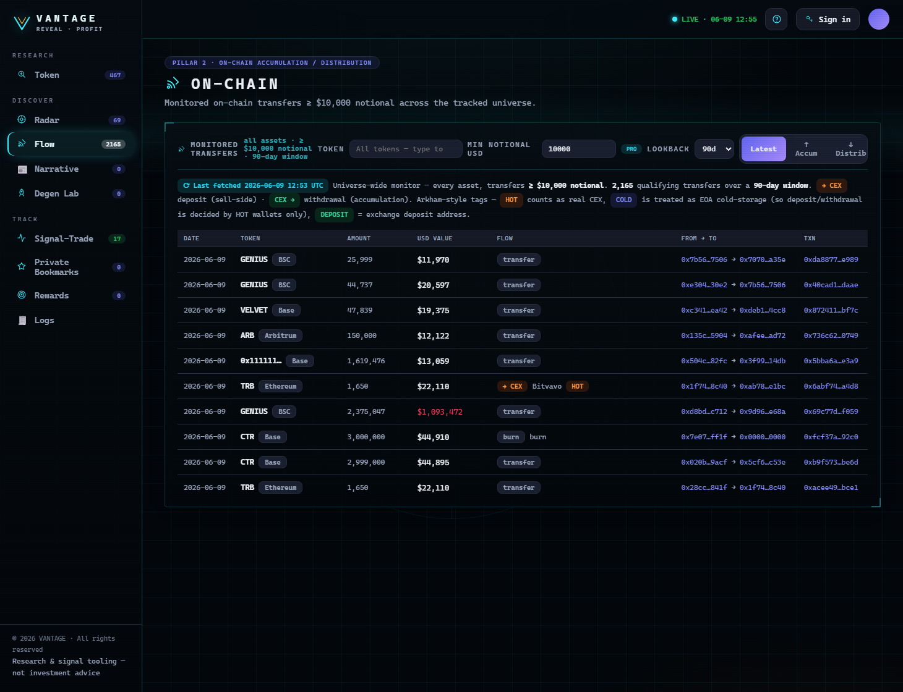

# Flow

**Discover → Flow** shows what **smart money and exchanges** are doing on-chain — the supply side of the
story.

<figure><figcaption>
Monitored transfers ≥ $10k across the covered chains, tagged accumulation vs distribution per token.
</figcaption></figure>

## What it tracks

**Monitored transfers ≥ $10,000** across the covered chains, with the key read being **where supply is
moving**:

| Direction | Read |
| --- | --- |
| Supply **leaving** exchanges → wallets | **Accumulation** — coins going into cold storage / strong hands |
| Supply **arriving** at exchanges | **Sell-side pressure** — coins positioned to sell |

## How to use it

* Browse the **Monitored Transfers** feed for large moves.
* The **accumulation / distribution** read is aggregated **per ticker** — sum of value for the same token
  — so you see the net bias, not just individual transfers.
* **Filter by token** with the searchable **Token** box — start typing a symbol to jump to it, or open
  the list to browse every monitored token.
* Use the **PRO lookback** dropdown (45 / 60 / 90 days) to widen the transfer-history window.
* **Click a row's token** to open it in the [Token Workspace](../research/token-workspace.md); the
  **On-Chain** tab there is the same view scoped to a single token.


Exchange wallets are identified by a **labels / identity layer**. CEX address sets are kept in sync so the
"into/out-of exchange" read stays accurate.


---

**Next:** [Narrative →](narrative.md)
