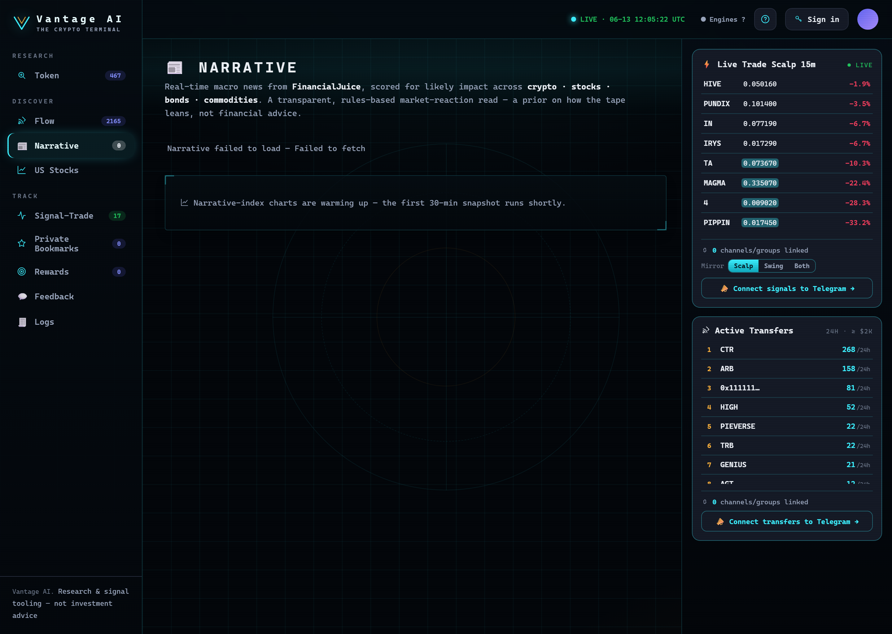

# Narrative

<figure><figcaption>
Narrative — real-time macro headlines scored for impact on crypto, stocks, bonds and commodities, with per-asset index-vs-price charts.
</figcaption></figure>

**Discover → Narrative** reads the **macro tape** — real-time financial news scored for its likely impact
on the markets that move crypto.

## What it does

It streams live headlines from **FinancialJuice** and scores each one for impact across **four asset
classes**:

* ₿ **Crypto**
* 📈 **Stocks**
* 🏦 **Bonds**
* 🛢 **Commodities** — split into **Gold** and **Oil**

The result is a **risk-on / risk-off tone**, a one-line read, a **bias card per asset class** (with the
top driving headlines), and a live, impact-tagged **headline tape**.

## How to read it

| Element | Meaning |
| --- | --- |
| **Tone badge** | *Risk-off* (havens bid, risk assets pressured), *Risk-on*, or *Mixed*. |
| **Asset cards** | Each shows a **bias** (Strongly Bullish → Strongly Bearish) + score + top drivers. |
| **Commodities → Breakdown** | Gold vs Oil split — e.g. geopolitics bids gold (haven) **and** oil (supply risk). |
| **Live tape** | Newest headlines with **▲ tailwind / ▼ headwind** chips per asset. |

The feed **auto-refreshes** while you're viewing it, or hit **↻ refresh**.

## How the scoring works

The current engine is a **transparent rules / lexicon model**: each headline is matched against ~15 macro
themes (geopolitics, hawkish/dovish, growth/slowdown, oil, gold, crypto, tariffs, USD…), each mapped to a
signed impact per asset class, then **recency-weighted** into the net bias.


It's a **prior on how the tape leans — not financial advice**, and not a forward price predictor. A
360-day backtest put its directional accuracy near coin-flip on a 5-day-forward basis (best on gold,
weakest on crypto). Use it as a **same-day context / "why is this moving"** layer.



**Roadmap:** the public version upgrades the analysis to an **LLM** for nuanced, context-aware reasoning.
The shared macro feed is cheap to serve at scale (it's one analysis for all users); richer per-user
features (portfolio impact, "ask the analyst") are planned as paid-tier add-ons.


---

**Next:** [US Stocks →](us-stocks.md)
