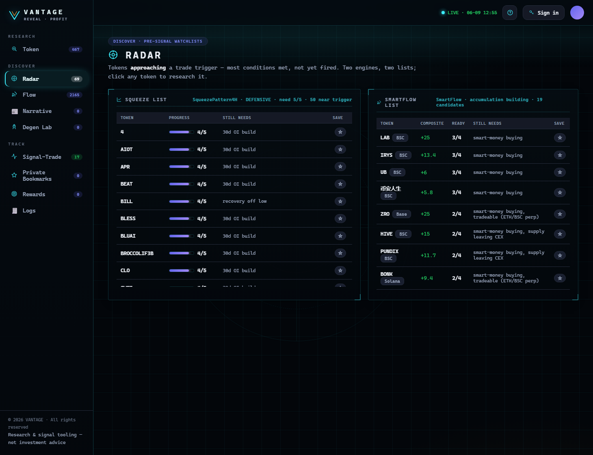

# Radar

**Discover → Radar** shows tokens that are **about to trigger** a trade — most conditions met, not yet
fired. It's how you see setups *forming* instead of chasing them after the move.

<figure><figcaption>
Radar — the Squeeze and SmartFlow lists, each token one feature short of firing.
</figcaption></figure>

## The two lists

| List | What it means |
| --- | --- |
| **Squeeze** | Futures **k-rule** candidates — typically **one feature short** of firing a SqueezePattern4H signal. |
| **SmartFlow** | On-chain **accumulation building** — wallets quietly stacking before it shows in price. |

## How to use it

* Scan the lists for tickers approaching a trigger.
* **Click any ticker** to open it in the [Token Workspace](../research/token-workspace.md) — Radar tickers
  resolve their on-chain market automatically, so you can run Forensics & Wallet Cluster on them.
* Treat Radar as a **watchlist of pre-signals**, not as confirmed trades. The trade fires (and is booked
  in [Signal-Trade](../track/signal-trade.md)) only when all conditions are met.


Radar tickers are often **Binance perp** symbols near a trigger. If a ticker isn't in the scored on-chain
universe yet, you'll still get a readiness read + a path to scan its contract.


---

**Next:** [Flow →](flow.md)
