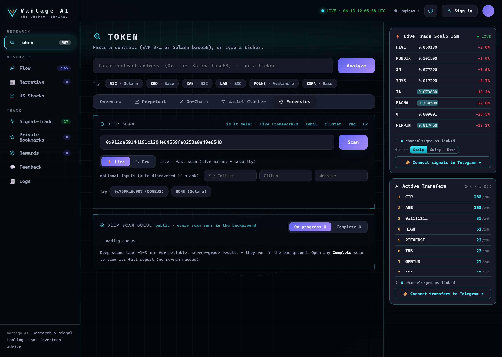

# Deep Scan (Forensics)

<figure><figcaption>
Deep Scan — paste a contract and run a Lite or Pro forensic scan; Pro runs server-grade in the background (sybil layers, clustering, LP / rug).
</figcaption></figure>

The **Forensics** tab answers: **"is this token a scam / rug?"** It runs a live, server-side forensic
engine — not a client-side approximation.

## How to run it

Deep scans take longer than other scans (~1–3 min for reliable, server-grade results), so **every deep
scan runs in the background** — you're never stuck waiting on a spinner.

1. Open a token's **Forensics** tab (the contract is pre-filled) and press **Scan** — or paste any
   contract into the Deep Scan box. You instantly get a **preview** while the full scan is queued.
2. Track it in the public **Deep Scan queue** below the scanner, which has two tabs:
   * **On-progress** — every token being scanned right now, each with a live **% progress** bar.
   * **Complete** — finished scans (verdict · score · top-10 %). **Click any row to open its full report.**
3. Results are **public and cached server-side** — anyone can open a completed scan without re-running it.


You can also run a deeper server-grade scan via
**🛰️ Full Forensics**. Solana tokens still scan inline (the server engine is EVM-only).


## What it checks

The engine produces a **9-objective** verdict, including:

* **Sybil / wallet clustering** — top-holder cohorts that are secretly one entity (shared funders,
  shared-token portfolios). See [Wallet Cluster](wallet-cluster.md) for the dedicated view.
* **Recursive funder traces** — who funded the holders, and whether they trace back to one source.
* **Holder concentration & persistence** — how tightly supply is held, and by whom over time.
* **Rug / LP risk** — liquidity, ownership, and contract-level red flags (via security providers).

The result is a **tiered verdict** (e.g. GREEN → RED) with a 9-objective breakdown so you can see *why*.

## Lite vs Pro

* **Lite** runs client-side for a fast first read.
* **Pro** runs the full server engine (deeper sybil stack: multi-layer funder trace, deployer-connection,
  per-wallet portfolio correlation). It falls back to the Lite read automatically if the server is
  unavailable or the chain isn't supported.

## Chains

EVM chains (Ethereum, Base, Arbitrum, Optimism, Polygon, **BSC**) run the full server engine; **Solana**
uses a dedicated SPL path. BSC top-holder cohorts are sourced via a fallback provider so clustering &
forensics work there too.


Forensics **reduces** rug risk — it does not eliminate it. A clean scan can still rug. Treat the verdict
as one input, not a guarantee.


---

**Next:** [Wallet Cluster →](wallet-cluster.md)
