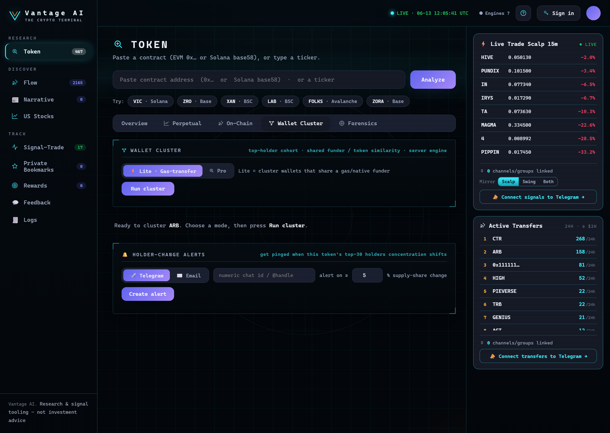

# Wallet Cluster

<figure><figcaption>
Wallet Cluster — which top holders are secretly connected (shared funders / token overlap), with cohort supply change over any date window.
</figcaption></figure>

The **Wallet Cluster** tab reveals which of a token's top holders are **secretly connected** — i.e.
controlled by the same entity. Big blocks of connected wallets are a single-source / sybil-distribution
tell.

## Running a cluster

1. Open a token → **Wallet Cluster** tab. It **won't run automatically** — clustering is an expensive
   scan, so it waits for you.
2. Pick a **mode** (below) — and in **Pro** mode, optionally drag a **date window** on the price chart
   first — then press **Run cluster**.

The engine pulls the **current top holders**, traces how they're linked, and groups them. Each cluster
shows its **combined % of supply** — how much the block controls together.

## Modes

| Mode | What it links on |
| --- | --- |
| **⚡ Lite · Gas-transfer** | Wallets that share a **gas/native funder** (the quick default). |
| **🔬 Pro · Automatic** | Engine auto-detects funder layers (depth 3) **+ token-ownership similarity**. |
| **🔬 Pro · Manual** | You set the **funder-layer depth** (4–8) and optionally paste **token addresses** to test shared ownership, with **AND / OR** logic. |

* **Funder layers** — how many hops back the engine traces each wallet's funding source. Deeper = catches
  more distant common ancestors (costs more time).
* **Token similarity** — wallets holding near-identical *other* tokens are likely one owner.

## The price-chart window (Pro)

In **Pro** mode a **price chart** appears with a draggable **window** (two handles + range presets
`1M / 3M / 6M / 1Y / All` and a **Log** toggle).

* **Drag the handles** (or the shaded band) to pick a **start–end period**.
* The clustering engine then **analyses within that window** — the funder-edge and economics signals are
  scoped to that period (the cohort itself stays the current top holders).
* The result shows the applied **Analysis window** so it's explicit.


**Supply change over the window (start → end).** When you set a date range, each cluster's share of supply
is snapshotted at **both** the start date **and** the end date and shown as a change — e.g. **`12% → 45% ▲`**
(green = the cluster *accumulated*, red ▼ = it *distributed*). The overall *"Clustered supply over window"*
row shows the same for all connected wallets combined. This reveals whether the cluster was **building or
dumping** a position over the period — not just what it holds today.


## Reading the result

* **Largest cluster %** and **total clustered %** — how concentrated control is.
* Per-cluster: **members**, **shared funders** (with layer), **shared tokens**, and **economics**
  (avg buy price, holdings, estimated PnL).
* Click any wallet to open it on the relevant block explorer.

## 🔔 Holder-change alerts

Below the results is a **Holder-change alerts** card. Subscribe to be pinged when the token's top-holder
concentration shifts:

1. Choose **Telegram** or **Email**.
2. Enter your **Telegram chat-id / handle** (or **email**).
3. Set a **% threshold** — how big a change in the **top-10 holders' share of supply** triggers an alert.
4. **Create alert.**

The platform snapshots the top-10 supply share now, then checks **hourly** and notifies you when it moves
by ≥ your threshold.


**Telegram:** message the alerts bot first (or paste your **numeric chat-id**) so it can reach you —
Telegram bots can't DM strangers. **Email** is stored & queued; delivery is pending an email provider.


## Chains

EVM (Ethereum, Base, Arbitrum, Optimism, Polygon, **BSC**) and **Solana**. Cohorts come from on-chain
holder data (with a fallback provider for BSC).

---

**Next:** [Radar →](../discover/radar.md)
