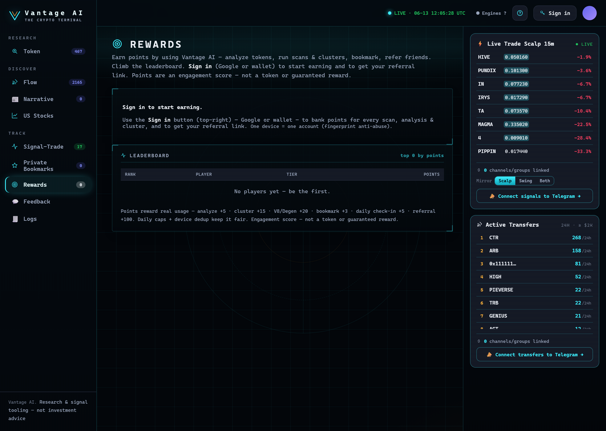

# Rewards

<figure><figcaption>
Rewards — points for every scan, cluster and analysis; referral links and the live leaderboard.
</figcaption></figure>

**Track → Rewards** turns research into points. Earn as you use the terminal, climb the leaderboard, and
refer friends.

## Earning points

You earn points for **real usage** (with daily caps + anti-abuse so it stays fair). Representative values:

| Action | Points |
| --- | --- |
| Sign in (once) | +25 |
| Daily check-in | +5 |
| Analyze a token | +5 |
| Run a Wallet Cluster | +15 |
| Deep Scan / Degen scan | +20 |
| Bookmark a token | +3 |
| View / depth actions | +1–2 |
| **Referral (you / them)** | **+100 / +25** |

Your **points badge** sits in the top bar once you're signed in; click it to open Rewards.

## Tiers

Points roll up into tiers: **Bronze → Silver → Gold → Platinum → Diamond**. Your tier and **rank** show on
your Rewards card.

## Referrals

* Your Rewards card has a **referral link** (`…/?ref=YOURCODE`).
* When someone **new** signs in through your link (new device + account), **you get +100** and **they get
  +25**.

## Leaderboard

The **Top-100 leaderboard** ranks players by points (masked handles). Compete for the top spots.


Points are an **engagement score** — not a token, security, or guaranteed reward. One device = one
account (a device fingerprint keeps farming out). See [Account & Sign-in](../account.md).


---

**Next:** [Glossary →](../reference/glossary.md)
