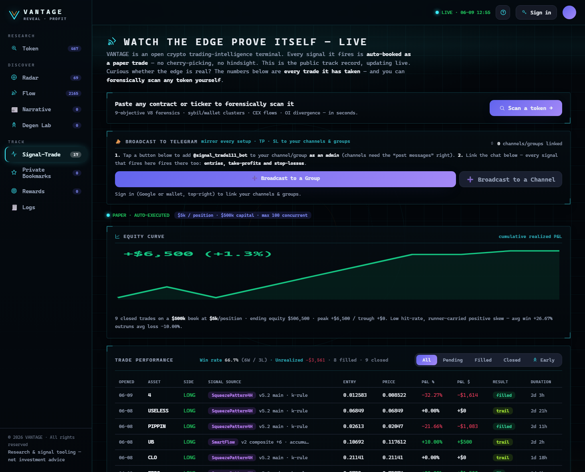

# Signal-Trade

**Track → Signal-Trade** is our **public paper track record**. We trade our own signals in the open so the
edge is **shown, not just claimed**.

<figure><figcaption><p>The public paper book — equity curve, performance stats, the live trade table, and the Telegram broadcast card.</p></figcaption></figure>

## What it is

When a signal fires, it's **auto-executed as a paper trade** and recorded here — entries, exits, P&L, and
running stats. Nothing is hidden or back-filled after the fact.

## How trades are run (paper-trading rules)

Uniform assumptions across every trade:

* Fixed **notional per position** and a fixed **initial capital** with a max number of concurrent
  positions.
* Each strategy documents its **entry rule, take-profit / stop, timeout and cooldown** (e.g. the
  SqueezePattern4H 4-hour k-rule with a TP/SL and a 3-bar pre-entry price-change filter).
* Fills, take-profits, stops, timeouts and cancels are applied on a schedule by the engine — no manual
  intervention.

## How to read the record

* **Win rate, profit factor, net P&L, return %** — the headline stats.
* The **equity curve** shows cumulative performance; low hit-rate / runner-carried positive skew is
  expected for this style (avg win outruns avg loss).
* Each row links back to the token's [Token Workspace](../research/token-workspace.md).


**Paper, not live.** This is a simulated track record for transparency and research. Past simulated
performance does not guarantee future results, and is not financial advice.


## Broadcast signals to your Telegram

The **📣 Broadcast to Telegram** card lets you mirror every live signal into your own Telegram channels and
groups — the same entries, take-profits and stop-losses, the moment they fire on the site.

1. Tap **➕ Broadcast to a Group** or **➕ Broadcast to a Channel** — this opens Telegram and adds the
   **@smartflow111_bot** to your chat. Make it an **admin** (a channel needs the *post messages* right).
2. Back on the site, **link the chat**: paste a public **@username**, or a private chat's numeric
   **`-100…`** id (add the bot, then forward any message to **@getidsbot** to get the id), and press
   **Link**. You'll get a confirmation message in that chat.
3. From then on, every signal broadcasts there automatically. The card shows **how many channels/groups
   are linked**, and you can unlink any of them.

What gets sent:

```
🎯 ENTRY  MAGMAUSDT · LONG @ 0.432 · TP +30% / SL −30%
🟢 TAKE PROFIT  MAGMAUSDT · +30.0% (+$1,500)
🔴 STOP LOSS  XYZUSDT · −15.0% (−$750)
```


A Telegram bot can only post to a chat **after** it's been added there, and a **private** group/channel
needs the numeric `-100…` id rather than an @username. Sign in (Google or wallet) to manage your links.


---

**Next:** [Private Bookmarks →](bookmarks.md)
